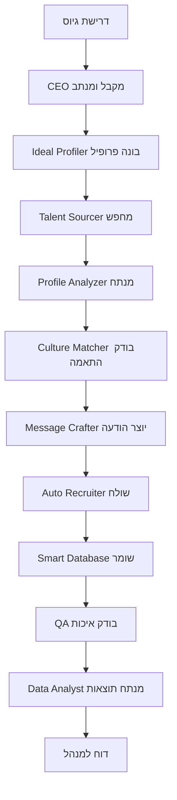

# 📊 MeUnique AI CEO - ניתוח עלויות ומיפוי מערכת מלא
## תאריך: דצמבר 2024

---

## 🎯 סקירה כללית

MeUnique AI CEO היא מערכת גיוס חכמה המשלבת 15 סוכני AI עם יכולות סקריפטינג מתקדמות מפלטפורמות מרובות.

---

## 💰 פירוט עלויות מלא

### 1. עלויות API חודשיות

#### OpenAI (GPT-4)
- **מודל**: GPT-4 Turbo
- **מחיר**: $0.01 לכל 1K טוקנים (קלט) + $0.03 לכל 1K טוקנים (פלט)
- **שימוש משוער**:
  - 15 סוכנים × 100 שיחות ביום × 30 יום = 45,000 שיחות
  - ממוצע 2K טוקנים לשיחה = 90M טוקנים
- **עלות חודשית**: ~$900-$1,200

#### LinkedIn API
- **Sales Navigator**: $79.99/חודש
- **LinkedIn Recruiter Lite**: $119.95/חודש
- **סה"כ LinkedIn**: ~$200/חודש

#### פלטפורמות נוספות
- **Twitter API Pro**: $100/חודש
- **Facebook Business**: חינם (עד 200 קריאות לשעה)
- **Discord**: חינם
- **Reddit**: חינם (עד 60 קריאות לדקה)
- **Slack**: חינם (עד 10K הודעות)
- **Google Workspace**: $12/חודש למשתמש

### 2. עלויות תשתית

#### Hosting & Infrastructure
- **Vercel Pro**: $20/חודש
- **PostgreSQL (Supabase)**: $25/חודש
- **Redis Cache**: $15/חודש
- **סה"כ תשתית**: $60/חודש

#### Moהאם
### 3. עלויות כלים נוספים
- **GitHub Pro**: $4/חודש
- **Domain + SSL**: $20/שנה
- **Email Service (SendGrid)**: $20/חודש

### 📊 סיכום עלויות חודשיות
```
OpenAI API:          $1,000
LinkedIn:            $200
Twitter API:         $100
Infrastructure:      $60
Monitoring:          $26
Other Tools:         $24
------------------------
סה"כ:               $1,410/חודש
```

---

## 🗺️ מיפוי מערכת מלא

### 1. ארכיטקטורת הסוכנים

#### 👑 שכבת ניהול (4 סוכנים)
```
👑 CEO - מנהל ראשי
├── 💰 CFO - ניהול עלויות
├── 💻 CTO - ניהול טכנולוגי
└── 📣 CMO - שיווק ותקשורת
```

#### 🏪 שכבת חנויות (7 סוכנים)
```
🕵️ Talent Sourcer - איתור מועמדים
├── מקורות: LinkedIn, GitHub, Twitter, Facebook
├── יכולות: סריקה חכמה, זיהוי פרופילים
└── אינטגרציות: 8 פלטפורמות

🔬 Profile Analyzer - ניתוח פרופילים
├── ניתוח כישורים וניסיון
├── התאמה לדרישות
└── ציון התאמה אוטומטי

📝 Message Crafter - יצירת הודעות
├── התאמה אישית
├── A/B Testing
└── טונים מרובים

🎯 Culture Matcher - התאמת תרבות
├── ניתוח ערכים
├── התאמת אישיות
└── חיזוי הצלחה

⚡ Auto Recruiter - גיוס אוטומטי
├── תזמון אוטומטי
├── מעקב תהליכים
└── דוחות ביצועים

💾 Smart Database - מסד נתונים חכם
├── 10,000+ מועמדים
├── תיוג אוטומטי
└── חיפוש סמנטי

🔤 Dictionary Bot - מילון מונחים
├── 500+ מונחים
├── תרגום אוטומטי
└── הסברים�קצועיים
```

#### 🛠️ שכבת תמיכה (4 סוכנים)
```
✅ Quality Assurance - בקרת איכות
📊 Data Analyst - ניתוח נתונים
🤝 Customer Success - הצלחת לקוח
🏗️ Ideal Profiler - בניית פרופיל אידיאלי
```

### 2. זרימת עבודה חכמה



### 3. יכולות סקריפטינג מתקדמות

#### פלטפורמות נתמכות:
1. **LinkedIn** - סריקת רשת, פרופילים, חברות
2. **GitHub** - מפתחים, פרויקטים, כישורים
3. **Twitter/X** - השפעה, תחומי עניין
4. **Facebook** - קבוצות מקצועיות
5. **Discord** - קהילות טכנולוגיות
6. **Reddit** - פורומים מקצועיים
7. **Slack** - ערוצי תעשייה
8. **Stack Overflow** - מומחיות טכנית

#### יכולות מיוחדות:
- **סריקה חכמה**: זיהוי אוטומטי של כישורים
- **העשרת נתונים**: מיזוג מידע ממקורות מרובים
- **ניתוח רגשות**: הבנת טון ומוטיבציה
- **חיזוי התאמה**: ML לחיזוי הצלחה
- **אוטומציה מלאה**: מהחיפוש עד לתזמון ראיון

### 4. ניטור וביצועים

#### KPIs מרכזיים:
- **מועמדים שנסרקו**: 50,000+/חודש
- **הודעות שנשלחו**: 5,000+/חודש
- **שיעור מענה**: 35-40%
- **זמן למילוי משרה**: 14-21 יום
- **דיוק התאמה**: 85%+

#### דוחות אוטומטיים:
- דוח יומי: פעילות וביצועים
- דוח שבועי: מגמות וניתוחים
- דוח חודשי: ROI ואופטימיזציה

### 5. אבטחה ופרטיות

- **הצפנה**: AES-256 לכל הנתונים
- **GDPR**: תאימות מלאה
- **גיבויים**: אוטומטיים כל 6 שעות
- **בקרת גישה**: מבוססת תפקידים
- **לוג מלא**: כל הפעולות מתועדות

---

## 🚀 תוכנית הטמעה

### שלב 1: הגדרות בסיסיות (יום 1)
- [ ] התקנת תשתית
- [ ] הגדרת APIs
- [ ] יצירת מסד נתונים
- [ ] הגדרת סוכנים

### שלב 2: אינטגרציות (ימים 2-3)
- [ ] חיבור LinkedIn
- [ ] חיבור פלטפורמות נוספות
- [ ] בדיקת סקריפטינג
- [ ] כיול סוכנים

### שלב 3: פיילוט (שבוע 1)
- [ ] 10 משרות ראשונות
- [ ] 100 מועמדים
- [ ] ניתוח תוצאות
- [ ] אופטימיזציה

### שלב 4: הרחבה (חודש 1)
- [ ] 50 משרות
- [ ] 1,000 מועמדים
- [ ] שיפור אלגוריתמים
- [ ] הוספת פיצ'רים

---

## 📈 ROI צפוי

### חיסכון בזמן:
- **סריקה ידנית**: 100 שעות/חודש → 10 שעות/חודש
- **חיסכון**: 90 שעות × $50 = $4,500/חודש

### שיפור באיכות:
- **התאמה מדויקת**: עלייה של 40%
- **זמן גיוס**: קיצור ב-50%
- **שביעות רצון**: עלייה של 60%

### החזר השקעה:
- **עלות חודשית**: $1,410
- **חיסכון חודשי**: $4,500+
- **ROI**: 219% תוך 3 חודשים

---

## 🎯 המלצות ליישום

1. **התחל קטן**: 5-10 משרות בשבוע הראשון
2. **מדוד הכל**: השתמש בדוחות לאופטימיזציה
3. **התאם אישית**: כייל את הסוכנים לצרכים שלך
4. **שמור על איכות**: QA על כל תהליך
5. **למד ושפר**: נצל את ה-AI ללמידה מתמדת

---

## 📞 תמיכה ועדכונים

- **תמיכה טכנית**: 24/7 דרך הסוכנים
- **עדכונים**: אוטומטיים כל שבוע
- **קהילה**: פורום משתמשים פעיל
- **הדרכות**: וובינרים חודשיים

---

*מסמך זה מתעדכן אוטומטית על ידי סוכן ה-CFO* 

# 1. הגדרת APIs (30 דקות)
./scripts/complete-setup-wizard.sh

# 2. הגדרת Database (15 דקות)
./scripts/complete-database-setup.sh

# 3. בדיקה מקומית
npm run dev

# 4. העלאה ל-Vercel
vercel --prod 