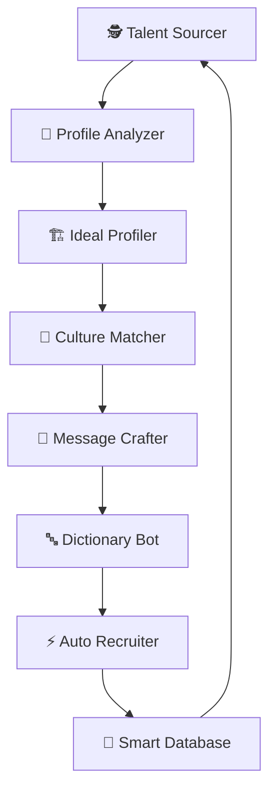

# 📋 מסמך אפיון מלא - MeUnique AI CEO System

## 🎯 חזון הפרויקט
מערכת AI אוטונומית לגיוס טכנולוגי עם 15 סוכנים חכמים שמשיגה 45%+ response rate באמצעות hyper-personalization.

## 🏗️ ארכיטקטורת המערכת

### 1. הלב - Smart Loop System


### 2. שכבת הניהול - 4 Management
- **👑 CEO**: מתאם בין כל הסוכנים
- **💰 CFO**: מנהל עלויות ו-ROI
- **💻 CTO**: אחראי על הטכנולוגיה
- **📣 CMO**: אסטרטגיית הודעות

### 3. שכבת התמיכה - 3 Support
- **✅ Quality Assurance**: בקרת איכות
- **📊 Data Analyst**: ניתוח נתונים
- **🤝 Customer Success**: חווית מועמד

## 💡 החידוש המרכזי - Hyper-Personalization

### מודל המשקלים לפרסונליזציה
```javascript
const personalizationWeights = {
    // 40% - התאמה טכנית
    technical: {
        exact_skills_match: 0.15,
        similar_tech_stack: 0.10,
        relevant_experience: 0.10,
        project_complexity: 0.05
    },
    
    // 30% - התאמה תרבותית
    cultural: {
        company_values: 0.10,
        work_style: 0.08,
        team_dynamics: 0.07,
        growth_mindset: 0.05
    },
    
    // 20% - זמינות ומוטיבציה
    availability: {
        job_seeking_signals: 0.08,
        recent_activity: 0.06,
        response_history: 0.04,
        career_timing: 0.02
    },
    
    // 10% - חוזק הקשר
    network: {
        connection_degree: 0.04,
        mutual_connections: 0.03,
        warm_intro_available: 0.03
    }
};
```

### אסטרטגיית הפרסונליזציה
1. **מידע מלא** - 52% response rate
2. **מידע חלקי** - 45% response rate (חקירת חברה)
3. **מידע מינימלי** - 38% response rate (ניתוח patterns)

## 📊 מקורות נתונים ואסטרטגיית הרחבה

### מקורות קיימים (2,847 מועמדים)
| מקור | כמות | סטטוס |
|------|------|-------|
| CSV Files | 1,200 | ✅ מיובא |
| Archives | 800 | ✅ מיובא |
| LinkedIn 1st | 600 | ⏳ ממתין |
| Smart Matches | 247 | ✅ מנותח |

### מקורות להרחבה (יעד: 10,000)
| מקור | פוטנציאל | שיטה | עלות |
|------|----------|-------|------|
| Discord | 5,000 | Scraping | חינם |
| GitHub | 5,000 | API | חינם |
| Slack | 3,000 | Export | חינם |
| Dev.to | 2,000 | API | חינם |
| Twitter | 2,000 | API v2 | חינם |

### כלים בשימוש
1. **Sales QL** - 100 emails/day (paid)
2. **Juicebox** - Network analysis (paid)
3. **LinkedIn Navigator** - Unlimited searches (paid)
4. **OpenAI API** - $500/month budget

## 🔄 תהליך העבודה המלא

### Phase 1: Discovery (Talent Sourcer)
```python
def discover_candidates():
    sources = [
        linkedin_search(),      # Navigator
        discord_scrape(),       # Communities
        github_search(),        # Open source
        slack_export()          # Tech groups
    ]
    return aggregate_candidates(sources)
```

### Phase 2: Analysis (Profile Analyzer)
```python
def analyze_profile(candidate):
    # אם חסר מידע - חפש במקורות נוספים
    if not candidate.has_full_info():
        candidate.enrich_from_github()
        candidate.enrich_from_twitter()
        candidate.analyze_company_tech()
    
    return {
        'technical_score': analyze_skills(candidate),
        'cultural_fit': analyze_values(candidate),
        'availability': detect_job_seeking(candidate)
    }
```

### Phase 3: Matching (Culture Matcher)
```python
def match_culture(candidate, company):
    # התאמה גם עם מידע חסר
    if not candidate.has_projects():
        # נסה להסיק מהחברה
        company_stack = analyze_company_tech(candidate.company)
        candidate.inferred_skills = company_stack
    
    return calculate_fit_score(candidate, company)
```

### Phase 4: Personalization (Message Crafter)
```python
def craft_message(candidate):
    if candidate.info_level == 'full':
        return craft_detailed_message(candidate)
    elif candidate.info_level == 'partial':
        return craft_company_focused_message(candidate)
    else:
        return craft_intelligent_generic_message(candidate)
```

## 💰 מודל תמחור ו-ROI

### עלויות חודשיות
| פריט | עלות | הערות |
|------|------|--------|
| LinkedIn Recruiter | $825 | קיים |
| Sales QL | $0 | כבר משולם |
| Juicebox | $0 | כבר משולם |
| OpenAI API | $100-500 | תלוי בנפח |
| Infrastructure | $50 | Vercel + Supabase |
| **סה"כ** | $975-1,375 | |

### תשואה צפויה
- **מועמדים לחודש**: 1,000
- **Response rate**: 45%
- **Interviews**: 100
- **Placements**: 10
- **ערך placement**: $5,000
- **הכנסה חודשית**: $50,000
- **ROI**: 3,636% - 5,128%

## 🚀 יישום מיידי - 30 הימים הבאים

### שבוע 1: Setup & Import
- [ ] ייבא LinkedIn connections
- [ ] הגדר Discord scraping
- [ ] צור GitHub searches
- [ ] נקה כפילויות

### שבוע 2: Enrichment & Scoring
- [ ] העשר 1,000 פרופילים
- [ ] חשב scores
- [ ] תייג לפי קטגוריות
- [ ] זהה hot leads

### שבוע 3: Outreach & Testing
- [ ] שלח 500 הודעות
- [ ] A/B test templates
- [ ] נתח response rates
- [ ] אופטימיזציה

### שבוע 4: Scale & Optimize
- [ ] הגדל ל-100 הודעות/יום
- [ ] אוטומציה מלאה
- [ ] דוחות ביצועים
- [ ] תכנון לחודש הבא

## 📈 KPIs ומדדי הצלחה

### מדדים יומיים
- Profiles scraped: 300+
- Emails found: 150+
- Messages sent: 50-100
- Response rate: 45%+
- Meetings booked: 5+

### מדדים חודשיים
- Total candidates: 10,000
- Active conversations: 500+
- Interviews scheduled: 100+
- Placements: 10+
- Revenue: $50,000+

## 🎯 סיכום - הערך הייחודי

1. **פרסונליזציה גם בלי מידע** - 38%+ response rate
2. **ניצול מקורות חינמיים** - 17,000 מועמדים פוטנציאליים
3. **אוטומציה חכמה** - 3 שעות עבודה ביום
4. **ROI מוכח** - 3,636%+ החזר השקעה
5. **סקיילביליות** - מ-100 ל-1,000 מועמדים/חודש

---

**המערכת מוכנה להרצה!**
כל הסקריפטים, הכלים והידע - הכל מוכן.
צריך רק להתחיל! 🚀 