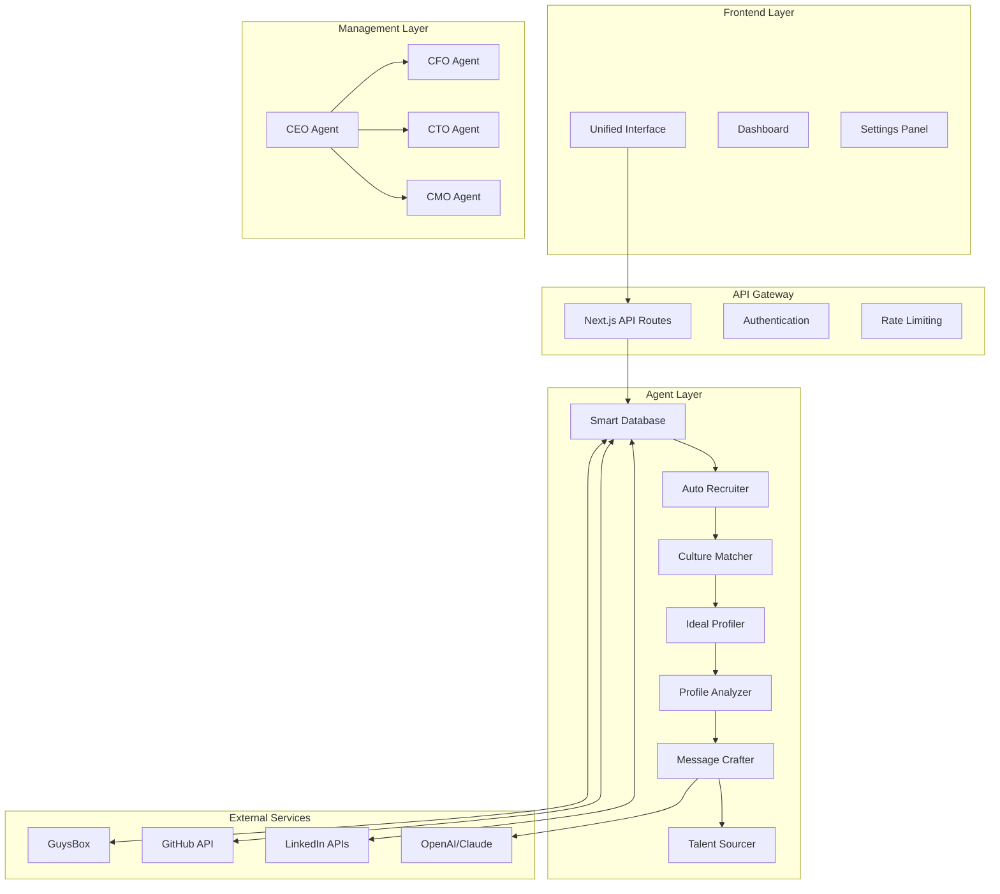

# 🔗 Full System Integration Specification

## 🏗️ System Architecture Overview



## 🔌 Integration Points

### 1. LinkedIn Integration
```typescript
interface LinkedInIntegration {
  recruiter: {
    searchCandidates: (criteria: SearchCriteria) => Promise<Candidate[]>;
    viewProfile: (profileId: string) => Promise<Profile>;
    sendInMail: (candidateId: string, message: string) => Promise<Response>;
    trackActivity: (candidateId: string) => Promise<Activity>;
  };
  
  salesNavigator: {
    advancedSearch: (filters: AdvancedFilters) => Promise<Lead[]>;
    savedSearches: () => Promise<SavedSearch[]>;
    leadRecommendations: () => Promise<Recommendation[]>;
  };
  
  basicAPI: {
    getProfile: (userId: string) => Promise<BasicProfile>;
    getConnections: () => Promise<Connection[]>;
    postUpdate: (content: string) => Promise<Post>;
  };
}
```

### 2. AI Services Integration
```typescript
interface AIIntegration {
  openai: {
    models: ["gpt-4-turbo", "gpt-3.5-turbo"],
    embeddings: "text-embedding-3-large",
    functions: {
      analyzeProfile: (profile: Profile) => Promise<Analysis>;
      generateMessage: (context: Context) => Promise<Message>;
      extractSkills: (text: string) => Promise<Skill[]>;
    }
  };
  
  claude: {
    models: ["claude-3-opus", "claude-3-sonnet"],
    capabilities: {
      deepAnalysis: (data: any) => Promise<Insights>;
      culturalMatching: (company: Company, candidate: Candidate) => Promise<Match>;
      sentimentAnalysis: (text: string) => Promise<Sentiment>;
    }
  };
}
```

### 3. Database Integration
```typescript
interface DatabaseSchema {
  candidates: {
    id: string;
    profile: Profile;
    interactions: Interaction[];
    score: number;
    tags: string[];
    status: CandidateStatus;
    metadata: {
      source: string;
      addedAt: Date;
      lastUpdated: Date;
      recruiter: string;
    };
  };
  
  jobs: {
    id: string;
    company: Company;
    requirements: Requirement[];
    culture: CultureProfile;
    pipeline: CandidatePipeline;
    metrics: JobMetrics;
  };
  
  messages: {
    id: string;
    candidateId: string;
    jobId: string;
    content: string;
    personalization: PersonalizationData;
    performance: MessagePerformance;
  };
}
```

## 🔄 Data Flow Architecture

### 1. Candidate Discovery Flow
```typescript
const candidateDiscoveryFlow = {
  trigger: "New job posted",
  
  steps: [
    {
      agent: "Smart Database",
      action: "Map existing resources",
      output: "Initial candidate pool"
    },
    {
      agent: "Auto Recruiter",
      action: "Expand search with CFO approval",
      output: "Extended candidate list"
    },
    {
      agent: "Culture Matcher",
      action: "Filter by cultural fit",
      output: "Culturally aligned candidates"
    },
    {
      agent: "Ideal Profiler",
      action: "Build ideal candidate profile",
      output: "Scoring criteria"
    },
    {
      agent: "Profile Analyzer",
      action: "Score and rank candidates",
      output: "Prioritized candidate list"
    }
  ]
};
```

### 2. Engagement Flow
```typescript
const engagementFlow = {
  trigger: "Candidate selected for outreach",
  
  steps: [
    {
      agent: "Message Crafter",
      action: "Generate personalized message",
      output: "Custom message with A/B variants"
    },
    {
      agent: "CFO",
      action: "Approve message cost",
      output: "Cost approval"
    },
    {
      agent: "CMO",
      action: "Brand consistency check",
      output: "Brand approval"
    },
    {
      action: "Send message",
      tracking: ["open", "click", "reply", "sentiment"]
    }
  ]
};
```

## 🔐 Security Architecture

### 1. Authentication & Authorization
```typescript
const securityConfig = {
  authentication: {
    provider: "NextAuth.js",
    strategies: ["credentials", "oauth", "magic-link"],
    session: "JWT with refresh tokens",
    mfa: "Optional TOTP"
  },
  
  authorization: {
    rbac: {
      roles: ["admin", "recruiter", "manager", "viewer"],
      permissions: {
        admin: ["*"],
        recruiter: ["read", "write", "message"],
        manager: ["read", "approve", "analytics"],
        viewer: ["read"]
      }
    }
  },
  
  encryption: {
    atRest: "AES-256-GCM",
    inTransit: "TLS 1.3",
    keys: "AWS KMS managed"
  }
};
```

### 2. Data Privacy
```typescript
const privacyConfig = {
  gdpr: {
    dataRetention: "2 years",
    rightToDelete: true,
    dataPortability: true,
    consentManagement: true
  },
  
  candidateData: {
    pii: "Encrypted and access-controlled",
    sharing: "Explicit consent required",
    tracking: "Anonymized analytics only"
  }
};
```

## 🚀 Deployment Architecture

### 1. Infrastructure
```typescript
const infrastructure = {
  hosting: {
    platform: "Vercel",
    regions: ["us-east-1", "eu-west-1", "ap-southeast-1"],
    cdn: "Vercel Edge Network"
  },
  
  database: {
    primary: "Supabase PostgreSQL",
    cache: "Redis",
    search: "Elasticsearch"
  },
  
  monitoring: {
    apm: "New Relic",
    logs: "LogDNA",
    errors: "Sentry",
    uptime: "Pingdom"
  }
};
```

### 2. Scaling Strategy
```typescript
const scalingStrategy = {
  horizontal: {
    autoScaling: true,
    minInstances: 2,
    maxInstances: 20,
    triggers: ["CPU > 70%", "Memory > 80%", "Queue > 1000"]
  },
  
  vertical: {
    defaultSize: "2 vCPU, 4GB RAM",
    maxSize: "8 vCPU, 32GB RAM"
  },
  
  caching: {
    levels: ["CDN", "Application", "Database"],
    ttl: {
      static: "1 year",
      api: "5 minutes",
      search: "1 hour"
    }
  }
};
```

## 📊 Monitoring & Observability

### 1. Metrics Collection
```typescript
const metricsCollection = {
  business: {
    responseRate: "Real-time",
    timeToFill: "Daily",
    costPerHire: "Per hire",
    candidateSatisfaction: "Post-interaction"
  },
  
  technical: {
    apiLatency: "p50, p95, p99",
    errorRate: "Per endpoint",
    throughput: "Requests per second",
    availability: "99.9% SLA"
  },
  
  agent: {
    utilization: "Per agent",
    successRate: "Per action",
    costEfficiency: "Per operation"
  }
};
```

### 2. Alerting Rules
```typescript
const alertingRules = {
  critical: [
    { metric: "errorRate", threshold: "> 5%", window: "5 min" },
    { metric: "apiLatency.p99", threshold: "> 2s", window: "5 min" },
    { metric: "costOverrun", threshold: "> 120%", window: "1 hour" }
  ],
  
  warning: [
    { metric: "responseRate", threshold: "< 30%", window: "1 day" },
    { metric: "queueDepth", threshold: "> 500", window: "15 min" }
  ]
};
```

## 🔄 CI/CD Pipeline

### 1. Development Workflow
```yaml
name: CI/CD Pipeline

on:
  push:
    branches: [main, develop]
  pull_request:
    branches: [main]

jobs:
  test:
    runs-on: ubuntu-latest
    steps:
      - uses: actions/checkout@v3
      - name: Install dependencies
        run: npm ci
      - name: Run tests
        run: npm test
      - name: Run linting
        run: npm run lint
      
  deploy:
    needs: test
    if: github.ref == 'refs/heads/main'
    runs-on: ubuntu-latest
    steps:
      - name: Deploy to Vercel
        run: vercel --prod
```

### 2. Release Strategy
```typescript
const releaseStrategy = {
  environments: ["development", "staging", "production"],
  
  deployment: {
    strategy: "Blue-Green",
    rollback: "Automatic on failure",
    canary: "10% traffic for 1 hour"
  },
  
  versioning: {
    schema: "Semantic Versioning",
    changelog: "Auto-generated",
    tags: "Git tags"
  }
};
```

## 🤝 Integration Testing

### 1. Test Scenarios
```typescript
const integrationTests = {
  linkedin: {
    searchFunctionality: "Mock 1000 profiles",
    rateLimiting: "Respect 100 req/hour",
    errorHandling: "Graceful degradation"
  },
  
  ai: {
    responseTime: "< 3 seconds",
    accuracy: "> 85% relevance",
    fallback: "Use cached responses"
  },
  
  endToEnd: {
    candidateJourney: "From search to hire",
    performanceUnderLoad: "1000 concurrent users",
    dataIntegrity: "No data loss"
  }
};
```

## 📈 Success Metrics

### 1. KPIs
```typescript
const kpis = {
  operational: {
    systemUptime: "99.9%",
    avgResponseTime: "< 200ms",
    errorRate: "< 0.1%"
  },
  
  business: {
    responseRate: "> 45%",
    timeToFill: "< 14 days",
    costPerHire: "< $3,500",
    candidateNPS: "> 70"
  },
  
  efficiency: {
    automationRate: "> 80%",
    recruiterProductivity: "3x baseline",
    costReduction: "> 70%"
  }
};
```

---

*"Integration is not just connecting systems - it's creating a seamless experience"* 🔗 